# nfc writer ios app

nfc writer app is a hacky fun side project that writes twitter and contact (links) to writable nfcs. runs on iPhone 7+ iOS 14+. join the [testflight](https://testflight.apple.com/join/F0avLiZi)

this app should have been built this in `SwiftUI`, but I really wanted to play with diffable data source (yes, extreemly easy and flexible). 

#### had fun exploring:
- `UITableViewDiffableDataSource`
- `NSDiffableDataSourceSnapshot`
- `UIListContentConfiguration`
- `CoreNFC`
- `Contacts`

#### did not have fun (finding bug workarounds):
- `ContactsUI`
- `UISearchController`

## getting started

- [firebase storage](https://firebase.google.com): enables contacts via links

- [swiftlint](https://github.com/realm/SwiftLint): lint

- [fastlane](https://fastlane.tools): automate build and release

### xcode command line tools (macOS)
```
xcode-select --install 
```

### install dependencies via homebrew
```
brew install fastlane swiftlint
``` 

### fastlane setup
```
fastlane init
```

### config linting @ `.swiftlint.yml`

## screenshots

### main
<br>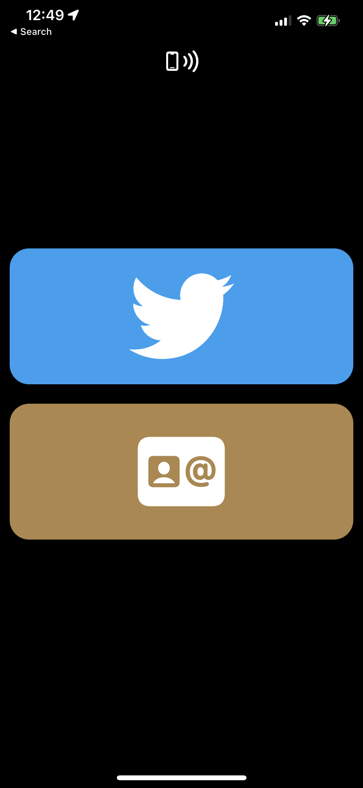

### twitter nfc writing flow
<br>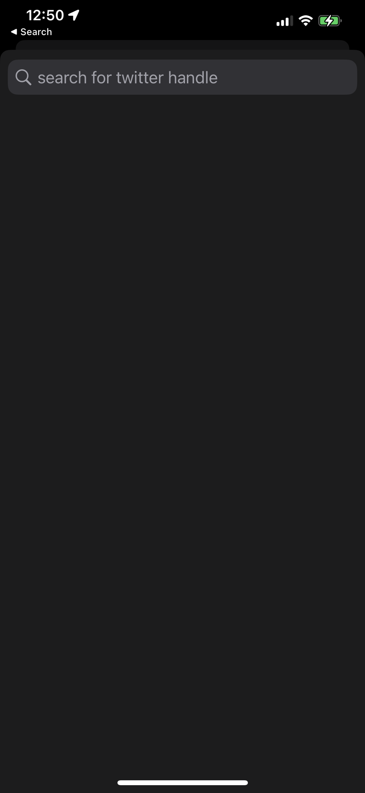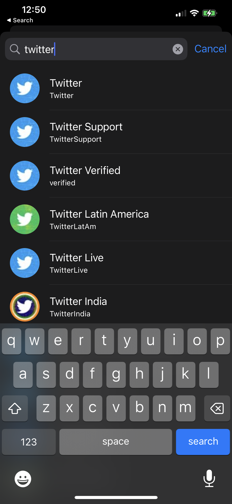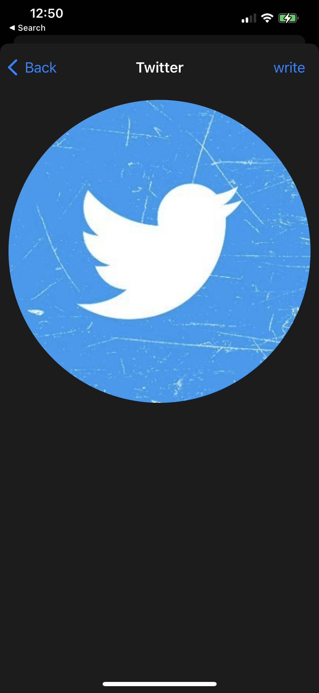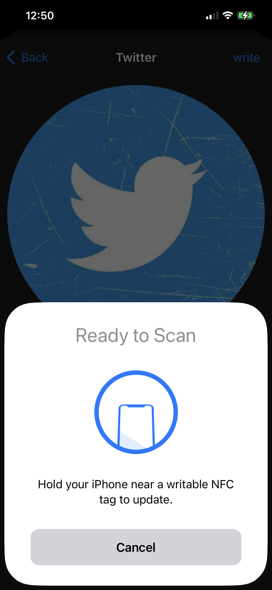

### contact nfc writing flow
<br>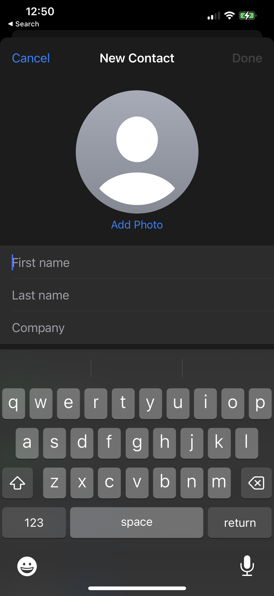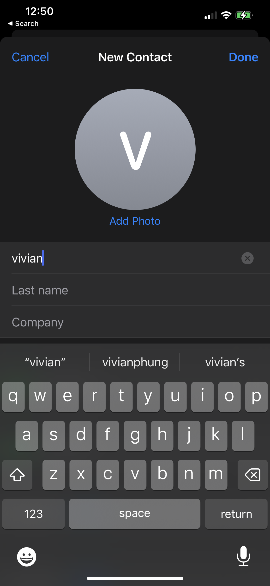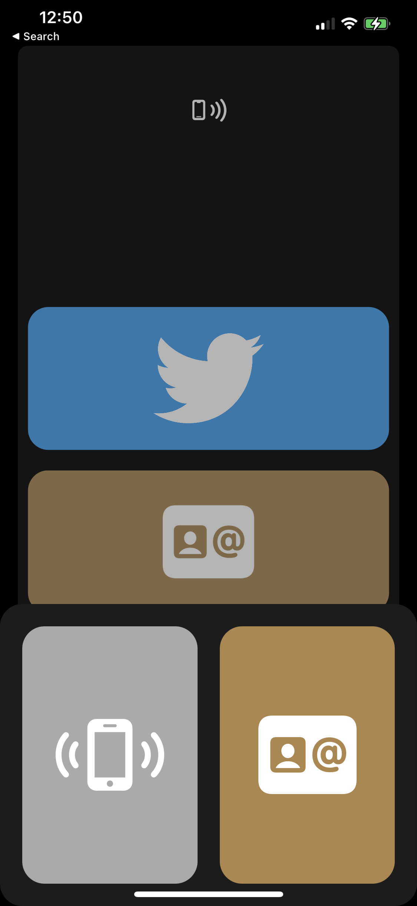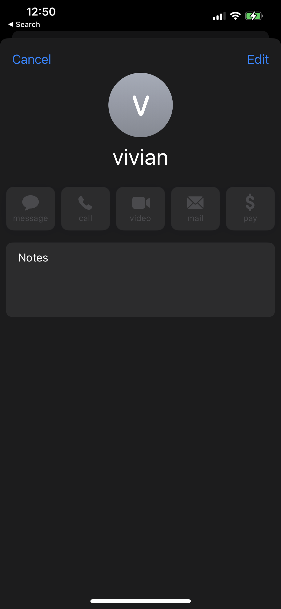
<br>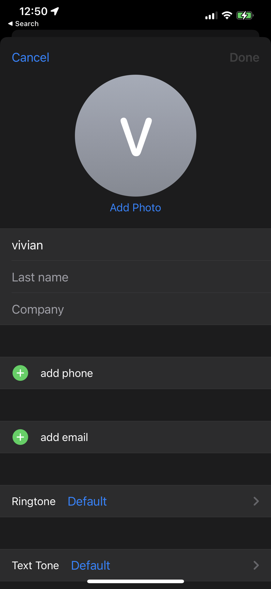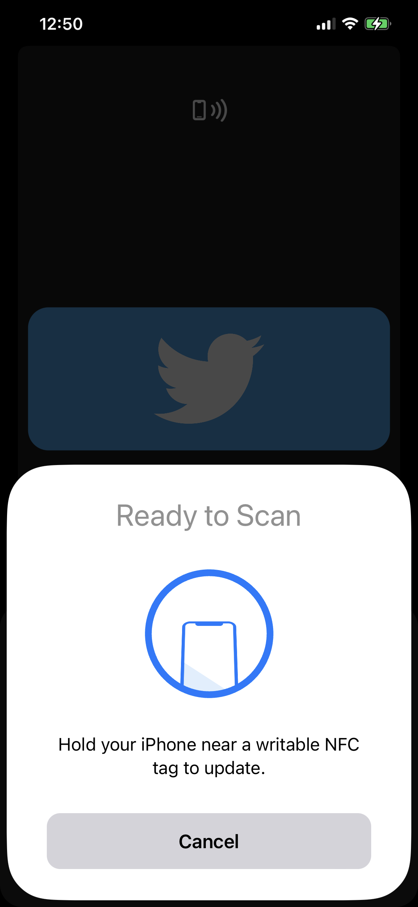
